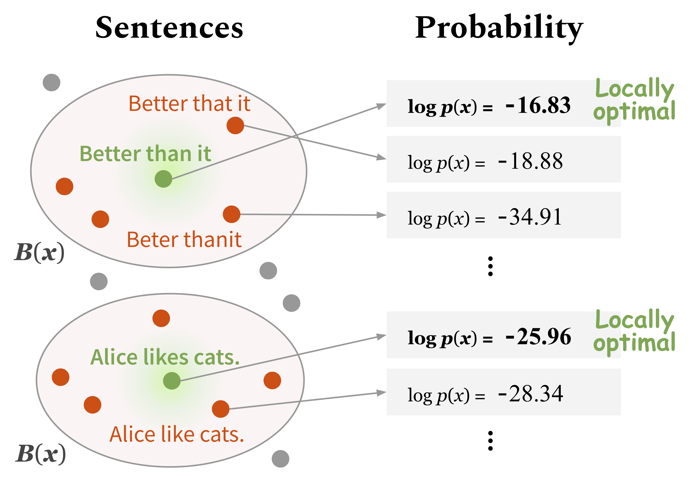
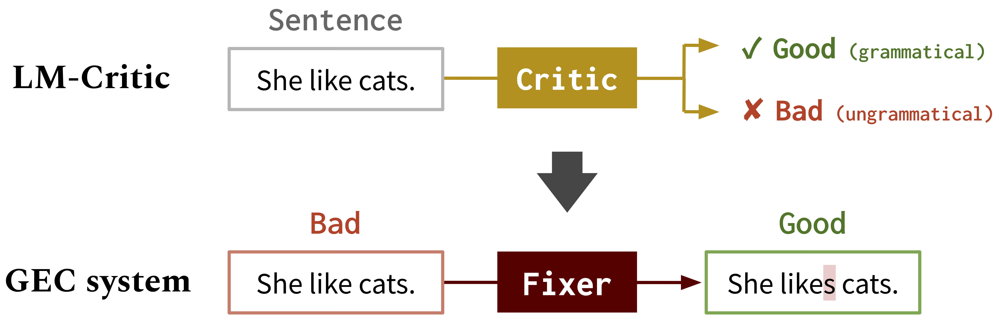

# LM-Critic: Language Models for Unsupervised Grammatical Error Correction

This repo provides the source code & data of our paper: [LM-Critic: Language Models for Unsupervised Grammatical Error Correction](http://arxiv.org/abs/2109.06822) (EMNLP 2021).
```bib
@InProceedings{yasunaga2021language,
  author =  {Michihiro Yasunaga and Jure Leskovec and Percy Liang},
  title =   {LM-Critic: Language Models for Unsupervised Grammatical Error Correction},
  year =    {2021},  
  booktitle = {Empirical Methods in Natural Language Processing (EMNLP)},  
}
```

### Overview

We developed a new method to use a pretrained language model (e.g. GPT2) to predict if a sentence is grammatical, which we call **LM-Critic**. You can play with this LM-Critic as described in Section 1. below. The idea is to deem a sentence to be grammatical if the language model assigns it a higher probability than candidates in its local neighborhood.

We then use the LM-Critic to generate training data for grammatical error correction (GEC) from unlabeled raw text, using the [BIFI algorithm](https://github.com/michiyasunaga/BIFI). This allows us to train GEC models in an unsupervised way. See Section 2. below.


**How LM-Critic works**
<p align="center">
  
</p>


**LM-Critic for GEC**: We use LM-Critic to learn GEC models
<p align="center">
  
</p>


## 0. Dependencies

Run the following commands to create a conda environment (assuming CUDA10.1):
```bash
conda create -n lm-critic python=3.8
conda activate lm-critic
pip install torch==1.6.0 torchvision==0.7.0
pip install transformers==4.3.3 datasets==1.3.0 absl-py rouge-score
pip install nltk wandb editdistance spacy==3.0.5
python3 -m nltk.downloader punkt
```

To use the [ERRANT](https://github.com/chrisjbryant/errant) scorer for GEC evaluation, create another conda environment separately, as follows:
```bash
conda create -n errant200 python=3.6
conda activate errant200
pip3 install errant==2.0.0
python3 -m spacy download en
```


## <a name="lm_critic"></a> 1. Use LM-Critic

The LM-Critic is defined in `critic/critic.py`. To play with it, you can run:
```bash
CUDA_VISIBLE_DEVICES=0 python3 critic/critic.py
```
This will prompt you for a sentence input, and returns the judgment (Good: grammatical, Bad: ungrammatical) along with the probability score of the input sentence. For example,
```
Enter a sentence: I like apple.
Bad! Your sentence log(p) = -22.333
Neighbor sentence with highest log(p): I like apples. (= -19.570)

Enter a sentence: I like apples.
Good! Your sentence log(p) = -19.570
```

To run intrinsic evaluation of LM-Critic on a test suite, run:
```bash
CUDA_VISIBLE_DEVICES=0 python3 eval_critic/eval_critic.py
```
You can import the LM-Critic function (`from critic.critic import gpt2_critic`) for your own code as done in this script.


## <a name="gec"></a> 2. Train/run grammatical error correction models

Change the working directory to `gec/`.
First, download all the data (GEC benchmarks and training data) by running `./download_data.sh`.

#### Round 0
Here we train an initial fixer on synthetic GEC data. Run the commands in `src/run-round0.sh`.
 - This corresponds to the "Transformer" baseline in the paper Table 4.
 - The original synthetic data was downloaded from [here](https://github.com/awasthiabhijeet/PIE/tree/master/errorify), and our processed data is available at `data/round0__synthetic/synthetic_paired_data_9M.json`


#### Round 1
Here we use the BIFI algorithm and unlabeled text data to train an improved fixer. Run the commands in `src/run-round1.sh`.

 - Specifically, we perform the following four steps: (a) apply the current fixer (from Round 0) to unlabeled sentences and keep outputs that LM-Critic judges as good; (b) train a breaker on the paired data generated in Step (a); (c) apply the trained breaker on unlabeled sentences and keep outputs that LM-Critic judges as bad; (d) train the fixer on the paired data generated so far (Step (a) + Step (c) + synthetic data from Round0).
 - This corresponds to the "+ BIFI" in the paper Table 4.
 - The original unlabeled text data was downloaded from [Yahoo! Answer dataset](https://www.kaggle.com/soumikrakshit/yahoo-answers-dataset) and [Wikipedia revision dataset](https://github.com/snukky/wikiedits) (we take sentences pre revision). Our processed paired data used in Step (d) is available at `data/round1__BIFI/BIFI_paired_data_9M.json`


For evaluation, we use [ERRANT](https://github.com/chrisjbryant/errant) and [M^2Scorer](https://github.com/nusnlp/m2scorer). ERRANT is set up in the conda environment described above (errant200) and M^2Scorer is set up in the download script.
